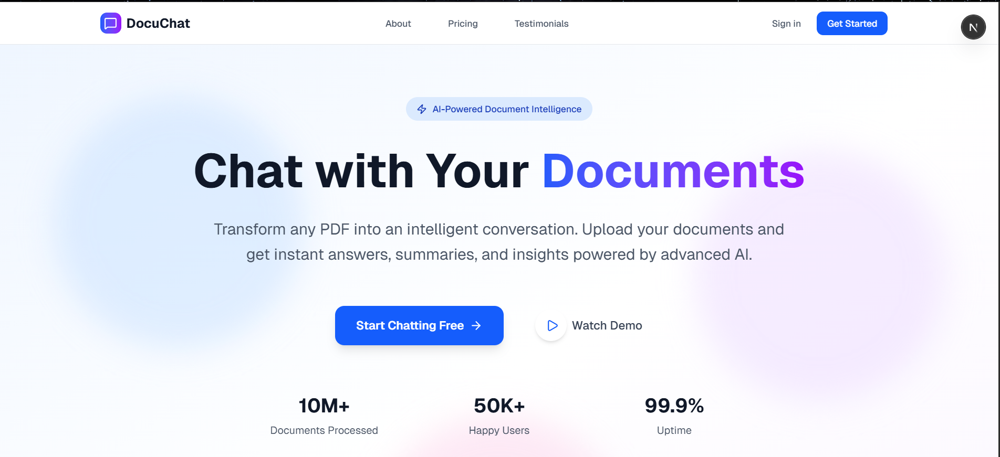
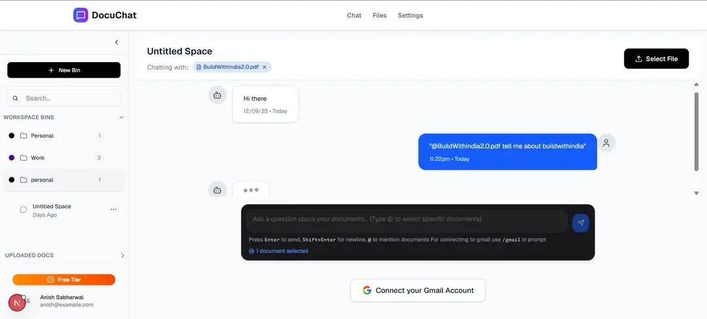
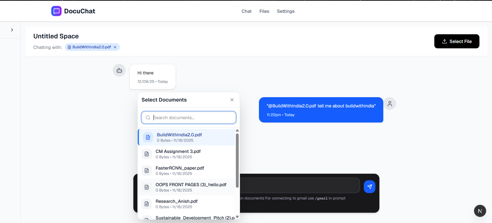

# Docuchat:

- Docuchat: used for doing RAG on documents which can be uploaded & lets users upload documents and chat with them.
- Tech Stack: Next.js frontend + FastAPI backend system (Turborepo)










# Get Started with the Repo:

1. Clone the Repo:

```bash
git clone https://github.com/anishs1207/docuchat-app.git
cd docuchat-app
```

2. Run the Nextjs Frontend:

```bash
cd apps
cd web
npm run dev
```

3. Run the Fastapi Backend:

- Move to the server repo:

```bash
cd apps
cd server
```

- Create the venv & run the fastapi app

```bash
python -m venv venv
source venv/Scripts/activate
pip install -r requirements.txt
python -m uvicorn main:app --reload
```
